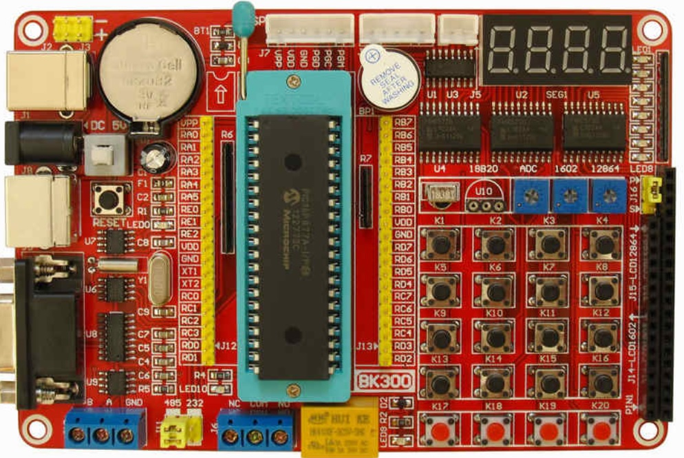
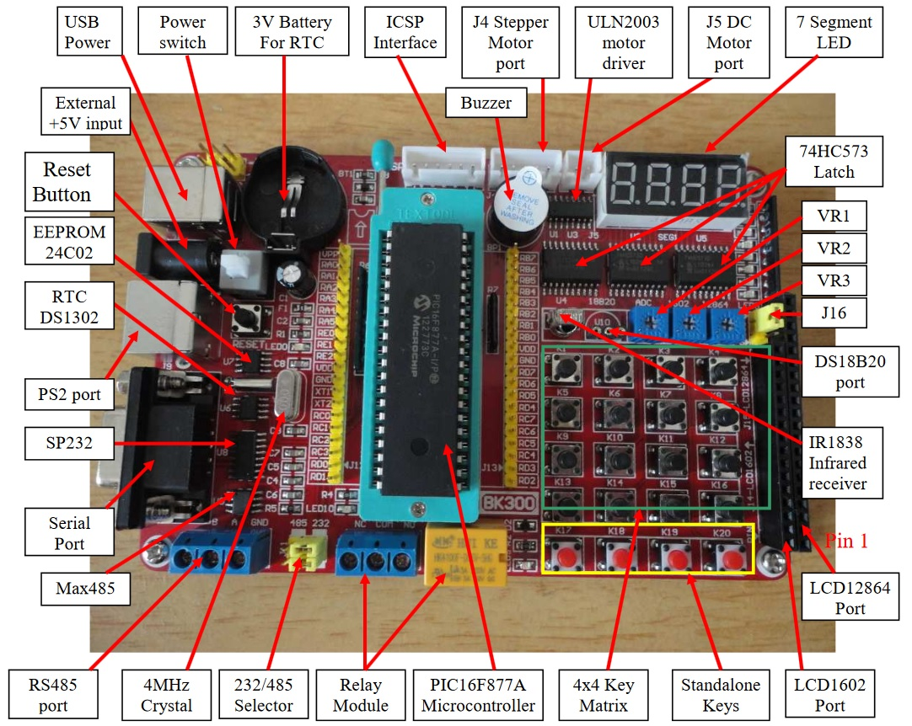
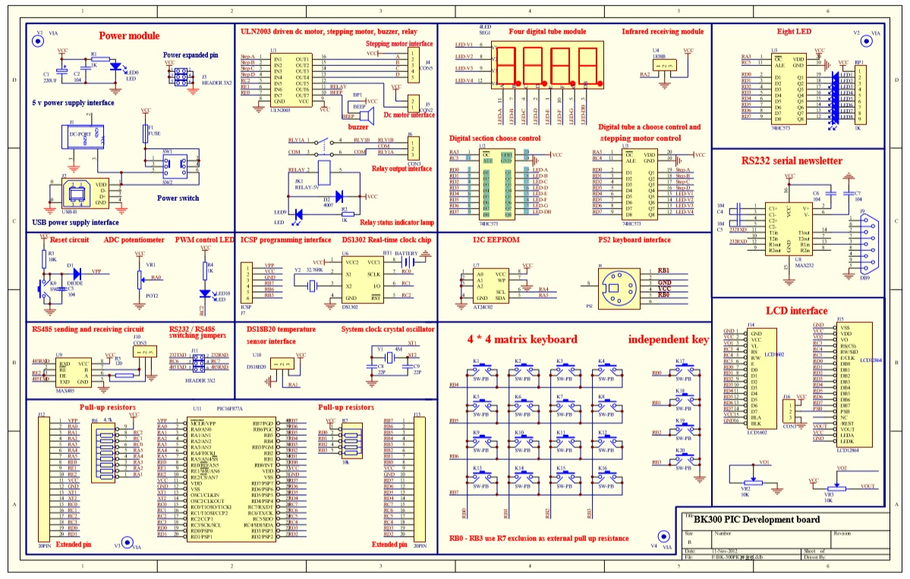

# BK300-Pic16f877A-development-Board-Examples

This repository is for collecting the programs as supplied with the BK300 Pic Development board as seen in the picture above
When time permits, I hope to load versions of these programs so that they can be easily used with the latest version of the MPLAB X and the XC8 compiler. The original programs are in folder "BK300_original_code" and are as follows
 - Experiment_01_LED  
 - Experiment_02_4x4_Keyboard  
 - Experiment_03_LED 	 
 - Experiment_04_Interupt 	 
 - Experiment_05_timer1 	 	 
 - Experiment_06_timer2 	 
 - Experiment_07_RS232 	 
 - Experiment_08_EEPROM  
 - Experiment_09_Watchdog
 - Experiment_10_ADC 
 - Experiment_11_Speaker  
 - Experiment_12_PWM  
 - Experiment_13_3x3_Keyboard  
 - Experiment_14_LCD_16x2 	 
 - Experiment_15_AT24C02 	 
 - Experiment_16_stepper 	 
 - Experiment_17_IR_Display   
 - Experiment_18_DS18B20  
 - Experiment_19_DS1302  
 - Experiment_20_LCD_128x64  
 - Experiment_21_RS485 	 
 - Experiment_22_PS2_Keyboard
 - Experiment_23_IR_Relay  
 - Experiment_24_AT24C02  

# Layout of Components

# Schematic Diagram

# Important points
- The following 6 items are not normally supplied with the development board. You will need to obtain the following so you can use the associated software
  - "Pickit 3" programmer not supplied - You need to purchase this separately. If you don't have this programmer, you cannot load anything into the pic 
  - "DS18B20 temperature sensor" (or any 1-wire sensor) not supplied  - You need to purchase this separately and insert the wires into the U10 connector 
  - "Stepper motor" not supplied 
  - "PS2 Keyboard" not supplied
  - "LCD 16x2" not supplied
  - "LCD 128x64" not supplied
 - There are 2 ways to supply regulated 5V to this dev board. (N.B. There is no power supply regulator onboard - a regulated 5v supply must be used)
   - via a USB (printer cable type) connector -  N.B. If you look at the schematic, the data pins of USB connection are not connected. 
   - Via power plug 
 - The four "7 segment" displays, eight LEDs and four Stepper motor pins are controlled with the use of three 74HC573 "One way latches" which are connected to the PORTD bus as follows (N.B. All three latches are Output enabled using pin RA3):   
   - Latch 1 - Latched via RC3
     - PORTD pins RD0 to RD7  - used for sinking the current of one segment in ecah of the four 7 segment display units, plus its decimal point  
   - Latch 2 - Latched via RC4
     - PORTD pins RD0 to RD3  - used for selecting each of the four 7 segment display units
     - PORTD pins RD4 to RD7  - used for driving the stepper motor pins 
   - Latch 3 - Latched via RC5
     - PORTD pins RD0 to RD7  - used for driving the eight LEDS 
 - Not that it is required to do so, but if all 3 latches above are disabled for output by pin RA3 being HIGH, then the eight data pins of PORTD are available for use for anything else. However, if you were to mix output enabling with the strobing of data on PORTD, you could make it appear that all three sets of output devices are used with the use of PORTD only  - but uniquely controlling each latch very quickly one after the other
 - Jumper J16 is used for when you use a LCD_128x64 only. The position of the jumper determines if a HIGH or LOW is to be defaulted to the PSB pin of the LCD_128x64 - it is set to HIGH as this sems ot be the default for most programs 
